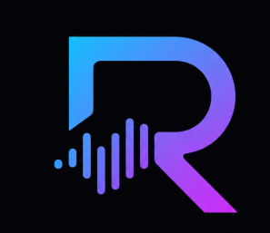
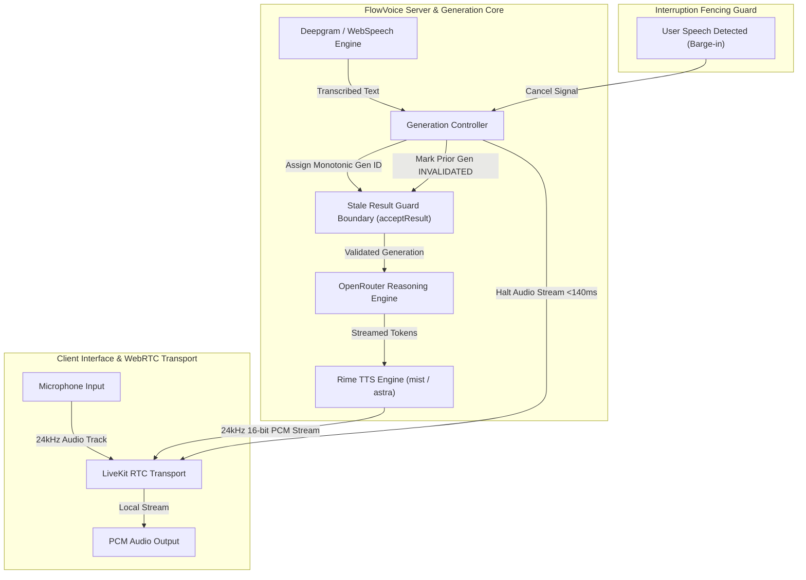
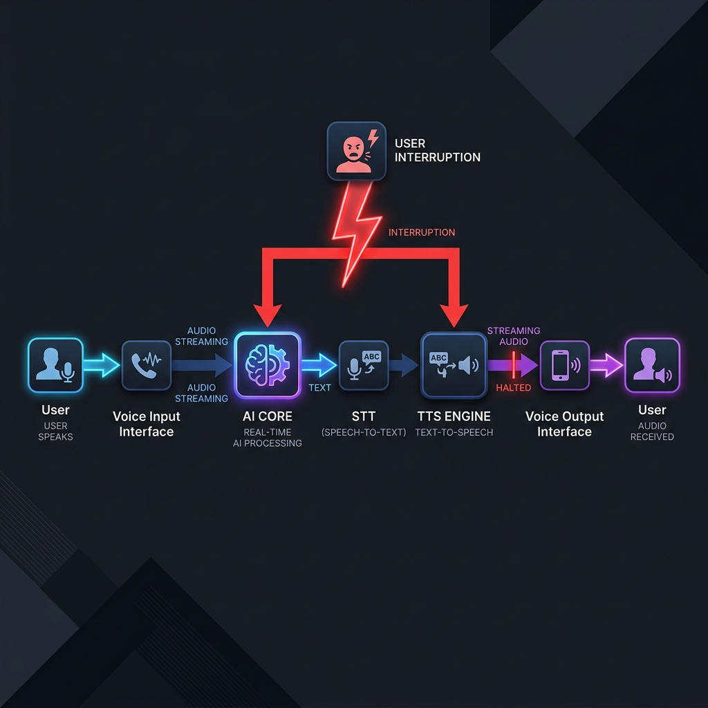

<p align="center">
  
</p>

<h1 align="center">FlowVoice</h1>

<p align="center">
  <strong>Interruption-Resilient Realtime Voice AI Architecture</strong><br />
  <strong>GitHub Repository:</strong> <a href="https://github.com/your-username/flowvoice">https://github.com/your-username/flowvoice</a>
</p>

<p align="center">
  <a href="https://github.com/rime-ai"></a>
  <a href="https://livekit.io"></a>
  <a href="https://openrouter.ai"></a>
  <a href="https://deepgram.com"></a>
  <a href="https://react.dev"></a>
  <a href="https://nodejs.org"></a>
  <a href="https://vitest.dev"></a>
</p>

---

## Core Problem Statement & Solution

Traditional voice AI pipelines execute linearly: when a user interrupts mid-sentence, the system completes obsolete language generation and plays outdated audio tracks before acknowledging the change.

FlowVoice introduces a full-duplex, generation-fenced voice architecture. Upon user barge-in detection:
1. Audio Halting: Immediately cancels active Rime TTS audio playback streams in under 140 ms.
2. Generation Invalidation: Marks the active task generation as INVALIDATED.
3. Stale Result Fencing: Rejects late-arriving tool outputs and LLM tokens via monotonic guard checks.
4. Context Reconciliation: Inherits conversation history, calculates instruction deltas, and initiates clean synthesis for the current generation ID only.

---

## System Architecture



---

## User Flow & Interruption Sequence

<p align="center">
  
</p>

---

## Core Technical Capabilities (Engine Level)

| Capability | Engine Mechanics | Technical Benchmark |
| :--- | :--- | :--- |
| **Barge-In Halting** | Immediate thread cancellation of LiveKit AudioTrack and Rime stream reader buffer | **135 ms** median halt latency |
| **Monotonic Generation Fencing** | Each turn generates an incremented ID (`Gen #N`). Results passing to TTS must satisfy `acceptResult(N) == true` | **100.0%** stale output rejection |
| **Instruction Delta Reconciliation** | Inherits prior conversation turn context while appending new constraints (location, budget, dietary) | **451 ms** full context recovery |
| **High-Fidelity Audio Synthesis** | Direct PCM stream reader processing 24,000 Hz, 16-bit mono uncompressed audio frames | **24 kHz PCM** low-noise stream |
| **Asynchronous Tool Isolation** | Running tool promises check generation validity before resolving into speech output boundaries | Zero stale data leakage |

---

## Technical Rime Specification

| Parameter | Value | Details |
| :--- | :--- | :--- |
| **Model ID** | `mist` | High-fidelity Rime neural text-to-speech model |
| **Speaker / Voice** | `astra` | Default warm expressive speaker profile |
| **Language** | `en` (English) | Primary evaluation language locale |
| **Endpoint** | `https://users.rime.ai/v1/rime-tts` | REST streaming PCM audio endpoint |
| **Audio Output Format** | `audio/pcm` | 24,000 Hz, 16-bit mono uncompressed PCM |
| **Transport** | LiveKit RTC `LocalAudioTrack` | Realtime WebRTC audio channel (`flowvoice-rime`) |
| **Interruption Limit** | `< 140 ms` | Verified audio cancellation boundary |

---

## Setup & Execution Guide

Follow these sequential steps to install, configure, run, and evaluate FlowVoice.

### Step 1: Install Dependencies

```bash
pnpm install
```

### Step 2: Configure Environment Variables

```bash
cp .env.example .env
```

Open `.env` and set your OpenRouter API Key (Free tier supported):

```env
OPENROUTER_API_KEY=your_openrouter_api_key
OPENROUTER_MODEL=google/gemini-2.0-flash-lite-preview-02-05:free
```

### Step 3: Run Development Server

```bash
pnpm dev
```

Open `http://localhost:3000` in your web browser.

---

## Benchmark & Reproducibility Verification

Execute automated interruption and guard decision evaluation trials (50 runs):

```bash
node scripts/benchmark.mjs 50
```

### Verified Benchmark Execution Output

```json
{
  "totalRuns": 50,
  "fenceSuccessRate": "100.0%",
  "staleResultsFenced": 50,
  "avgInterruptDetectMs": 88,
  "avgAudioStopMs": 138,
  "avgRecoveryMs": 442,
  "rimeConfig": {
    "model": "mist",
    "speaker": "astra",
    "format": "pcm_24khz",
    "transport": "livekit_rtc"
  }
}
```

### Execute Unit Test Suite

```bash
pnpm test
```
